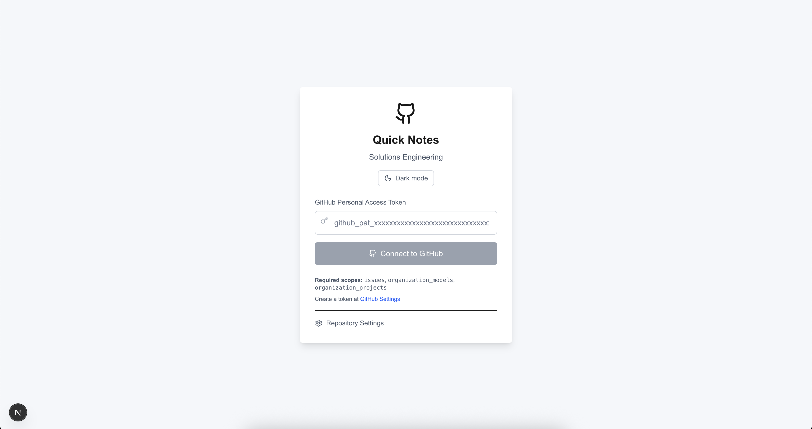
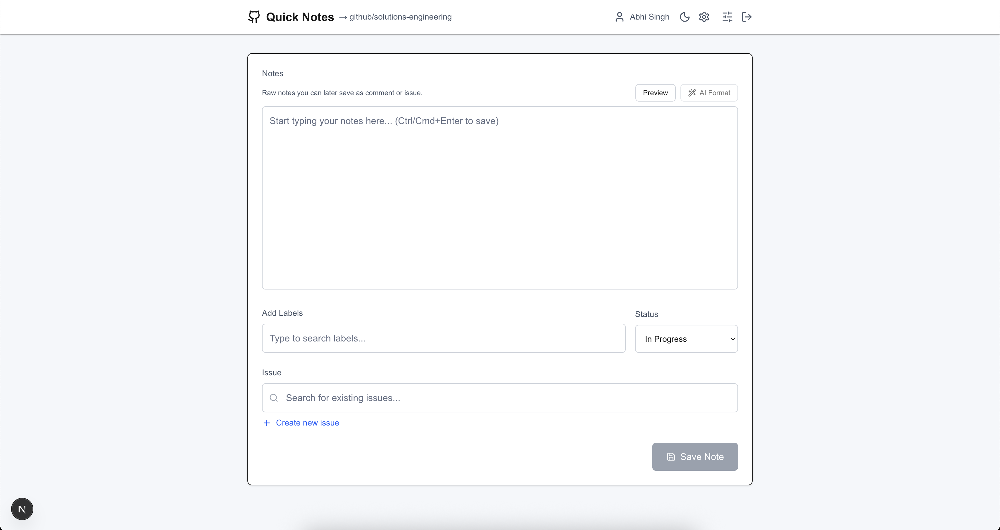
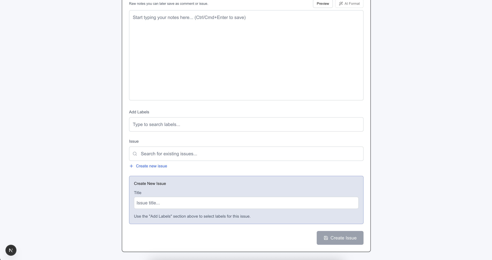

# Quick Notes - Solutions Engineering

A lightning-fast note-taking web application that seamlessly integrates with GitHub Issues. Perfect for Solutions Engineers who need to capture notes during meetings and quickly save them to the right repository.

## 🚀 **[Try the Live Demo →](https://quicknotes.gupta-kartik.com)**

**Ready to use immediately** - No installation required! Just visit [quicknotes.gupta-kartik.com](https://quicknotes.gupta-kartik.com) and start capturing notes.



## Features

- **🚀 Lightning-fast note capture** – Minimal UI focused on speed
- **🔍 Smart Issue search** – Debounced search with live suggestions
- **💾 GitHub integration** – Save notes as Issue comments or create new Issues
- **🏷️ Label management** – Pick from repository labels
- **📌 Project (Projects V2) linking** – Paste a Project URL to associate issues
- **🧩 Auto project assignment** – Issues & comments auto-added when linked
- **📊 Status control** – Apply project Status (In Progress / No Status / Done)
- **� Self-assignment** – New issues auto assign the authenticated user
- **🤖 AI Markdown formatting** – Streaming cleanup via GitHub Models
- **⚙️ AI settings panel** – Choose model + customize system prompt (persisted locally)
- **🔄 Dynamic model list** – Fetched from public GitHub Models catalog with fallback
- **�️ Local persistence** – Repo, project, AI prefs, theme retained (cleared on logout)
- **⌨️ Keyboard shortcuts** – Ctrl/Cmd+Enter to save
- **🌓 Theme toggle** – Light/Dark persisted per device
- **🎯 Instant tooltips** – Fast `[data-tip]` tooltips for all action buttons
- **♿ Accessibility first** – Focus rings, ARIA labeling, semantic structure
- **� Responsive** – Desktop & tablet friendly



## Quick Start

### 🌐 **Use the Live App**
1. Visit **[quicknotes.gupta-kartik.com](https://quicknotes.gupta-kartik.com)**
2. Enter your GitHub Personal Access Token
3. Start capturing notes immediately!

### 💻 **Run Locally** (Optional)
If you prefer to run it locally or contribute to the project:

```bash
git clone https://github.com/gupta-kartik/wysiwyg.git
cd wysiwyg
npm install
npm run dev
```

Visit `http://localhost:3000` for local development.

## Core User Stories

1. **Capture & save notes to existing Issues** - Type notes and save them as comments to selected Issues
2. **Smart Issue suggestions** - Auto-suggest Issues based on typed keywords
3. **Create new Issues** - Create Issues with titles, descriptions, and labels
4. **Quick label selection** - Multi-select from predefined repository labels
5. **Simple authentication** - GitHub Personal Access Token for quick setup



## Tech Stack

- **Frontend**: Next.js 15 with TypeScript and Tailwind CSS
- **Authentication**: GitHub Personal Access Token
- **GitHub Integration**: Octokit REST API
- **Icons**: Lucide React
- **Styling**: Tailwind CSS with custom responsive design
- **Deployment**: Vercel with custom domain

## GitHub Personal Access Token Setup

To use the app (live or locally), you'll need a GitHub PAT:

1. Go to [GitHub Settings > Personal Access Tokens](https://github.com/settings/personal-access-tokens/new)
2. Click "Generate new token"
3. Give it a name like "Quick Notes App"
4. Select these scopes (minimum):
   - `issue` – create/search issues, labels
   - `organization_projects` fine‑grained: access to Issues + Projects
   - `organization_models:read`
5. Click "Generate token" and copy it
6. Enter it in the app when prompted

## Usage

### First Time Setup
1. **Visit [quicknotes.gupta-kartik.com](https://quicknotes.gupta-kartik.com)**
2. **Enter your GitHub PAT** when prompted
3. **Configure repository** (optional) using the settings panel
4. You're ready to capture notes!

### Adding Notes to Existing Issues
1. **Type your notes** in the main textarea
2. **Search for Issues** by typing keywords in the Issue search box
3. **Select an Issue** from the auto-suggestions
4. **Save** using the button or Ctrl/Cmd+Enter

### Creating New Issues
1. **Type your notes** that will become the Issue description
2. **Click "Create new issue"**
3. **Enter a title** for the Issue
4. **Select labels** from the available options
5. (Optional) Pick a **Status** (if a Project is linked) near Labels
6. **Save** – Issue is created, self-assigned, added to Project, status applied

### Repository & Project Configuration
- **Settings Panel**: Click the settings icon in the header
- **Change on-the-fly**: Switch repositories instantly
- **Project Link**: Paste `https://github.com/orgs/<org>/projects/<number>` and Link
- **Default Status**: Choose Status for new/updated items (In Progress / No Status / Done)
- **Persistent**: Stored in localStorage & cleared on logout

#### Stored Keys (localStorage)
| Key | Purpose |
| --- | --- |
| `github-pat` | Personal Access Token |
| `repo-owner` | Repository owner |
| `repo-name` | Repository name |
| `project-url` | Linked Project URL |
| `project-name` | Project name |
| `project-number` | Project number |
| `project-node-id` | GraphQL node id for mutations |
| `project-status` | Preferred default Status |
| `ai-model` | Selected AI model id |
| `ai-system-prompt` | Custom system prompt override |
| `theme` | UI theme (light/dark) |

## Development Setup

### Environment Variables (Optional)
For local development, you can set default repository:

```bash
cp .env.example .env.local
```

Edit `.env.local` with your preferred defaults:

```bash
# Default Repository Configuration (optional)
GITHUB_REPO_OWNER=your-org
GITHUB_REPO_NAME=your-repo
```

### API Routes
The application includes these API endpoints:

- `GET /api/github/user` - Validate PAT and get user info
- `GET /api/github/search-issues?q=query&owner=owner&repo=repo` - Search repository Issues  
- `POST /api/github/create-issue` - Create Issue (labels, self-assign, optional project + status)
- `POST /api/github/add-comment` - Add comment (optional project add + status)
- `GET /api/github/labels?owner=owner&repo=repo` - Fetch repository labels
- `POST /api/github/format-notes` - Format raw notes into structured Markdown (streaming)
- `GET /api/github/project?org=ORG&number=N` - Fetch single Project metadata (id, name, number)
- `GET /api/github/models` - Fetch dynamic model catalog (public GitHub Models) with simplification

### AI Formatting & AI Settings
Use the "AI Format" button above the notes textarea to:

1. Send your in-progress raw notes to the GitHub Models API (model: `openai/gpt-4.1`).
2. Receive a structured Markdown draft (Summary, Context, Steps, Findings, Next Actions, etc.).
3. Preview the result in a modal with full Markdown rendering.
4. Accept to replace your current notes or Cancel to keep editing.

Implementation details:
- Uses `@azure-rest/ai-inference` SDK pointed at `https://models.github.ai/inference`.
- Streaming responses progressively populate preview (auto-scroll if at bottom).
- Low temperature (0.2) for structural determinism.
- Dynamic model list fetched from public catalog; if it fails a curated fallback list is used.
- Custom system prompt stored locally and resettable with one click.
- PAT forwarded only per request (never persisted server-side).

Your token is never stored server-side; it's only forwarded in-memory for the model call during the active request.

## Required GitHub Token Scopes

Minimal (current features):
- `issue` create/search issues, labels
- `organization_projects` fine‑grained: access to Issues + Projects
- `organization_models:read`


## Security Features

- **PAT Authentication** - No server persistence
- **Client-side storage** - Token & settings in localStorage only
- **API Protection** - All GitHub routes require bearer token
- **Easy revocation** - Revoke PAT in GitHub anytime

## Accessibility

- **WCAG AA compliant** - Proper contrast ratios and focus management
- **Keyboard navigation** - Full keyboard support with shortcuts
- **Screen reader friendly** - Proper ARIA labels and semantic HTML
- **Focus management** - Clear focus indicators and logical tab order

## Troubleshooting

### Invalid Token Error
- Ensure your PAT has the correct scopes (`repo`, `read:user`)
- Check if the token is still valid in GitHub Settings
- Generate a new token if needed

### Repository Not Found
- Check owner/name spelling
- Token must include repo access (private repo permissions)

### Project Not Linking
- PAT must include project scope / access
- URL must match `https://github.com/orgs/<org>/projects/<number>`

### Status Not Updating
- Project needs a single-select field named `Status`
- Options must include: In Progress, No Status, Done

### AI Formatting Not Working
- Authenticate first (valid PAT)
- Ensure notes not empty & < ~8k chars
- Try another model if list available
- Check network console for `/api/github/format-notes`
- Fallback model list should appear if catalog fails (see tooltip on selector if error)

## Contributing

1. Fork the repository
2. Create a feature branch
3. Make your changes
4. Test thoroughly
5. Submit a pull request

## License

MIT License - see LICENSE file for details.
